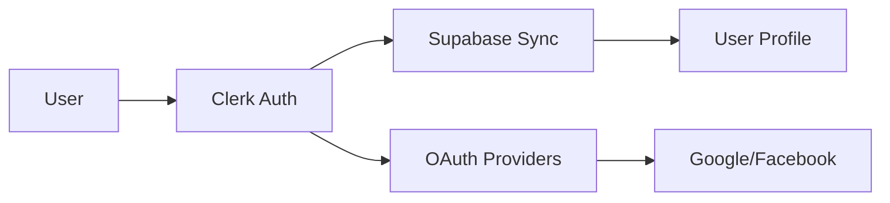
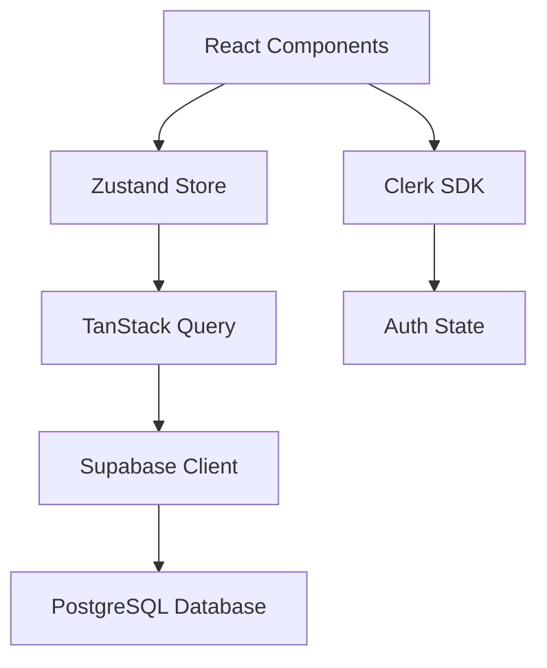

# 🏦 Finanza - Personal Finance App for Tunisia 🇹🇳

[](https://expo.dev/)
[](https://reactnative.dev/)
[](https://typescriptlang.org/)
[](LICENSE)

**Finanza** is a culturally-aware personal finance management application specifically designed for Tunisian users. Built with **Expo SDK 53**, **React Native**, **TypeScript**, **Clerk Authentication**, and **Supabase**, it offers authentic multilingual support (Tunisian Dialect, Arabic, French, English) with deep cultural awareness and local financial habits understanding.

> 🎯 **Mission**: Empower Tunisian families with a finance app that truly "speaks their language" and understands their cultural context, featuring an animated coin avatar assistant that provides guidance in authentic Tunisian dialect.

## � Quick Start

### **Prerequisites**
- Node.js 18+ ([Download](https://nodejs.org/))
- Expo CLI: `npm install -g @expo/cli`
- iOS Simulator (macOS) or Android Studio

### **Setup**
```bash
# Clone and install
git clone https://github.com/nextgen-coding/finanza.git
cd finanza
npm install

# Environment setup (.env file)
EXPO_PUBLIC_CLERK_PUBLISHABLE_KEY=pk_test_your_clerk_key_here
EXPO_PUBLIC_SUPABASE_URL=https://your-project.supabase.co
EXPO_PUBLIC_SUPABASE_ANON_KEY=your_supabase_anon_key_here

# Start development
npm start
```

### **Launch Options**
- **� iOS**: Press `i` (requires macOS + Xcode)
- **🤖 Android**: Press `a` (requires Android Studio)
- **🌐 Web**: Press `w` (runs in browser)

## � **Complete Documentation**

> **📖 For comprehensive guides, architecture details, and development workflows, visit our [Knowledge Base](./docs/KNOWLEDGE_BASE.md)**

### **🔥 Quick Access**
- **[🚀 Developer Quickstart](./docs/quick-reference/developer-quickstart.md)** - Start coding in 5 minutes
- **[🔧 Environment Setup](./docs/quick-reference/environment-checklist.md)** - Verify everything works
- **[📚 Component Library](./docs/quick-reference/component-cheatsheet.md)** - All UI components
- **[🗄️ Database Patterns](./docs/quick-reference/database-patterns.md)** - Common operations

### **📁 Documentation Structure**
```
docs/
├── 🧠 KNOWLEDGE_BASE.md          ← MAIN ENTRY POINT
├── 📁 quick-reference/           ← < 30 second access
├── 📁 development/               ← Setup & tools
├── 📁 architecture/              ← System design
├── 📁 features/                  ← Feature specifications
├── 📁 design/                    ← UI/UX guidelines
├── 📁 templates/                 ← Ready-to-use code
├── 📁 workflows/                 ← Development processes
└── 📁 troubleshooting/           ← Problem solving
```

## ✨ **Key Features**

### 💰 **Financial Management**
- **Transaction Tracking** with smart categorization
- **Budget Creation & Monitoring** with visual indicators  
- **Savings Goals** with milestone celebrations
- **Debt Management** for loans and bill reminders

### 🌍 **Cultural Integration**
- **Tunisian Dialect** - Authentic local expressions
- **Arabic RTL Support** - Proper right-to-left layout
- **Cultural Calendar** - Ramadan budgeting, Eid planning
- **Local Context** - Understanding Tunisian financial habits

### 🎨 **User Experience**
- **Finanza Avatar** - Animated coin character guide
- **Dark/Light Themes** - System preference detection
- **Haptic Feedback** - Tactile interaction responses
- **Cross-Platform** - iOS, Android, and Web support

## 🛠️ **Technology Stack**

| Component | Technology | Purpose |
|-----------|------------|---------|
| **Frontend** | Expo SDK 53 + React Native | Cross-platform mobile |
| **Language** | TypeScript | Type safety |
| **Styling** | NativeWind (Tailwind) | Consistent design |
| **Auth** | Clerk | User authentication |
| **Database** | Supabase | PostgreSQL with real-time |
| **State** | Zustand + TanStack Query | State management |
| **Navigation** | Expo Router | File-based routing |

## 🏗️ **Project Structure**

```
📁 Finanza/
├── 📱 app/                    # Screens (Expo Router)
│   ├── 🔐 auth/              # Authentication flow
│   ├── 🎯 onboarding/        # User setup
│   └── 📊 (tabs)/            # Main navigation
├── 🎨 components/            # Reusable UI components  
├── 🔧 lib/                   # Core business logic
├── 🌍 assets/                # Images, fonts, icons
├── 🎯 hooks/                 # Custom React hooks
├── 📚 docs/                  # Complete documentation
├── 🗄️ database/             # SQL migrations & schemas
└── ⚙️ Configuration files
```

## 🌍 **Supported Languages**

| Language | Code | Usage | Cultural Context |
|----------|------|-------|------------------|
| **🇹🇳 Tunisian Dialect** | `tn` | Primary | Authentic expressions, local humor |
| **🇸🇦 Arabic** | `ar` | Secondary | Standard Arabic with RTL |
| **🇫🇷 French** | `fr` | Business | Common in Tunisian business |
| **🇺🇸 English** | `en` | International | Fallback language |

### **Cultural Example Messages**
```javascript
"Ahla w sahla ya [username]!"              // Welcome!
"Ya sahbi, khalik maana nrakhou el budget!" // Buddy, let's organize the budget!
"El but mte3na wsel! Mabrouk!"             // Our goal is reached! Congratulations!
```

## 🗺️ **Development Status**

### **✅ Completed**
- [x] Project foundation (Expo + TypeScript)
- [x] Authentication system (Clerk)
- [x] Database setup (Supabase)
- [x] Multi-language support (4 languages)
- [x] Navigation structure
- [x] Component library & theming

### **🚧 In Progress**
- [ ] Transaction CRUD operations
- [ ] Budget creation and tracking
- [ ] Dashboard with financial overview
- [ ] Savings goals management

### **📋 Planned**
- [ ] Smart notifications in Tunisian dialect
- [ ] Receipt OCR and photo capture
- [ ] Financial insights and analytics
- [ ] Offline mode support

## 🤝 **Contributing**

We welcome contributions from developers who understand Tunisian culture!

### **How to Contribute**
1. **Fork** the repository
2. **Read** our [Development Guide](./docs/development/)
3. **Create** a feature branch
4. **Follow** our coding standards
5. **Submit** a pull request

### **Types of Contributions**
- 🌍 **Translations**: Improve Tunisian dialect
- 💻 **Code**: Features, bug fixes, performance
- 📚 **Documentation**: Guides, tutorials, examples
- 🎨 **Design**: UI/UX improvements

## 📄 **License**

This project is licensed under the **MIT License** - see the [LICENSE](LICENSE) file for details.

## 🆘 **Support & Resources**

- 📚 **Full Documentation**: [Knowledge Base](./docs/KNOWLEDGE_BASE.md)
- 🐛 **Bug Reports**: [GitHub Issues](https://github.com/nextgen-coding/finanza/issues)
- 💬 **Discussions**: [GitHub Discussions](https://github.com/nextgen-coding/finanza/discussions)
- 📧 **Contact**: For sensitive issues, email maintainers

---

**🎯 Ready to build the future of Tunisian financial management? Start with our [Developer Quickstart](./docs/quick-reference/developer-quickstart.md)!**
- **Multi-currency Support** with primary focus on Tunisian Dinar (TND)

### 🌍 **Cultural & Language Integration**
- **Authentic Tunisian Dialect** throughout the entire app interface
- **RTL (Right-to-Left) Support** for Arabic text rendering
- **Cultural Calendar** integration for Tunisian holidays and financial planning
- **Local Financial Habits** understanding (e.g., Ramadan budgeting, Eid expenses)
- **Smart Notifications** with culturally appropriate timing and messaging

### 🎨 **User Experience**
- **Finanza Coin Avatar** - Animated assistant with expressive emotions
- **Modern Material Design** with clean, intuitive interface
- **Haptic Feedback** for enhanced user interaction
- **Dark/Light Theme** support with system preference detection
- **Pixel-perfect Onboarding** with beautiful carousel showcasing features

### � **Smart Features**
- **AI-powered Categorization** for automatic expense classification
- **Smart Notifications** with Tunisian dialect messages
- **Budget Alerts** with cultural context ("راك قريب تكمّل الميزانية!")
- **Goal Celebrations** with local expressions ("مبروك! وصلت للهدف!")
- **Financial Insights** in authentic Tunisian Arabic

## 🛠️ Technology Stack

### **Frontend Architecture**
| Component | Technology | Version | Purpose |
|-----------|------------|---------|---------|
| **Framework** | Expo SDK | 53.0.20 | Cross-platform development |
| **Runtime** | React Native | 0.79.5 | Native mobile performance |
| **Language** | TypeScript | 5.8.3 | Type safety and developer experience |
| **Navigation** | Expo Router | 5.1.4 | File-based routing system |
| **Styling** | NativeWind | 4.1.23 | Tailwind CSS for React Native |

### **Backend & Data**
| Service | Technology | Purpose |
|---------|------------|---------|
| **Authentication** | Clerk | User auth, OAuth, session management |
| **Database** | Supabase | PostgreSQL with real-time subscriptions |
| **Storage** | Supabase Storage | File uploads (receipts, avatars) |
| **API** | Supabase Edge Functions | Serverless backend logic |

### **State & Data Management**
| Layer | Technology | Purpose |
|-------|------------|---------|
| **UI State** | Zustand | Lightweight global state management |
| **Server State** | TanStack Query | Data fetching, caching, synchronization |
| **Local Storage** | Expo SecureStore | Encrypted local data persistence |
| **Auth State** | Clerk SDK | Authentication state management |

### **Development Tools**
- **ESLint** - Code quality and consistency
- **TypeScript** - Compile-time error prevention
- **Metro** - JavaScript bundling and hot reload
- **EAS Build** - Cloud-based app compilation
- **Expo Dev Client** - Custom development builds

## 🏗️ Project Architecture

```
📁 Finanza/
├── 📱 app/                           # Application screens (Expo Router)
│   ├── 🔧 _layout.tsx                # Root layout with Clerk + theme providers
│   ├── 🏠 index.tsx                  # Auth gate & routing logic
│   ├── ❌ +not-found.tsx             # 404 error handling
│   │
│   ├── 🔐 auth/                      # Authentication flow (Clerk)
│   │   ├── 👋 welcome.tsx            # 4-slide onboarding carousel
│   │   ├── 📧 sign-in.tsx            # Email + OAuth login
│   │   ├── ✍️ sign-up.tsx            # Registration with verification
│   │   ├── 🔑 forgot-password.tsx    # Password reset flow
│   │   └── ✅ verify-email.tsx       # Email verification
│   │
│   ├── 🎯 onboarding/                # User setup & preferences
│   │   ├── 🏆 welcome.tsx            # New user introduction
│   │   ├── 👤 profile-setup.tsx     # Personal information
│   │   ├── 💰 financial-goals.tsx   # Financial planning setup
│   │   └── ⚙️ preferences.tsx       # App settings & language
│   │
│   └── 📊 (tabs)/                    # Main navigation tabs
│       ├── 🏗️ _layout.tsx            # Tab bar configuration
│       ├── 🏠 index.tsx              # Dashboard (Balance, Overview)
│       ├── 💳 transactions.tsx       # Transaction history
│       ├── 📈 budgets.tsx            # Budget creation & tracking
│       ├── 📅 calendar.tsx           # Financial calendar view
│       ├── 🎯 savings.tsx            # Savings goals management
│       ├── 💸 debts.tsx              # Debt tracking (optional tab)
│       ├── 👤 profile.tsx            # User profile & settings
│       └── ➕ add-transaction.tsx    # Quick transaction entry
│
├── 🎨 components/                    # Reusable UI components
│   ├── 🧩 ui/                        # Core design system
│   │   ├── 🔤 IconSymbol.tsx         # Cross-platform icon system
│   │   └── 📱 TabBarBackground.tsx   # Custom tab styling
│   ├── ➕ AddTransactionDrawer.tsx   # Transaction input modal
│   ├── 🔘 PlusButton.tsx            # Floating action button
│   ├── 📊 ThemedText.tsx            # Typography with theme support
│   ├── 🎭 ThemedView.tsx            # Containers with theme support
│   ├── 👋 HelloWave.tsx             # Animated greeting
│   └── 📜 ParallaxScrollView.tsx    # Parallax scroll container
│
├── 🔧 lib/                           # Core business logic
│   ├── 🌍 locales/                   # Translation files
│   │   ├── 🇹🇳 tn.json              # Tunisian dialect (primary)
│   │   ├── 🇸🇦 ar.json              # Standard Arabic (RTL)
│   │   ├── 🇫🇷 fr.json              # French
│   │   └── 🇺🇸 en.json              # English
│   ├── 🌐 i18n.ts                   # Internationalization engine
│   ├── 🔐 supabase.ts               # Database client configuration
│   ├── 📦 store.ts                  # Zustand global state
│   ├── 🔄 clerk-supabase-sync.ts    # User synchronization logic
│   ├── 🛡️ auth-utils-clerk.ts       # Clerk authentication helpers
│   └── 🛡️ auth-utils.ts             # Legacy auth utilities
│
├── 🎨 assets/                        # Static resources
│   ├── 🔤 fonts/                     # Custom typography
│   │   └── SpaceMono-Regular.ttf    # Monospace font
│   └── 🖼️ images/                    # App icons & illustrations
│       ├── icon.png                 # App icon (1024x1024)
│       ├── adaptive-icon.png        # Android adaptive icon
│       ├── splash-icon.png          # Splash screen
│       └── favicon.png              # Web favicon
│
├── 🎯 hooks/                         # Custom React hooks
│   ├── 🎨 useColorScheme.ts         # Theme detection
│   ├── 🌐 useI18n.ts                # Internationalization hook
│   └── 🎨 useThemeColor.ts          # Color management
│
├── 📏 constants/                     # App configuration
│   └── 🎨 Colors.ts                 # Theme color definitions
│
├── 📚 docs/                          # Comprehensive documentation
│   ├── 📋 PROJECT_SPECIFICATION.md  # Complete project overview
│   ├── 🏗️ TECHNICAL_ARCHITECTURE.md # System design
│   ├── 🎨 ui-ux-design-system.md   # Design guidelines
│   ├── 🌍 LOCALIZATION.md          # Translation guide
│   ├── 🛡️ SECURITY.md              # Security measures
│   └── 🚀 DEPLOYMENT.md            # Build & deployment
│
├── ⚙️ Configuration Files
│   ├── 📦 package.json              # Dependencies & scripts
│   ├── 🔧 app.json                  # Expo configuration
│   ├── 📝 tsconfig.json             # TypeScript settings
│   ├── 🎨 tailwind.config.js        # NativeWind styling
│   └── 🔍 eslint.config.js          # Code quality rules
│
└── 🌐 Environment & Setup
    ├── 🔐 .env                      # Environment variables
    ├── 📄 .gitignore               # Git ignore rules
    └── 📖 README.md                # This documentation
```

### **Key Architecture Decisions**

1. **File-based Routing**: Expo Router provides intuitive navigation structure
2. **Clerk + Supabase**: Best-in-class auth with powerful database
3. **NativeWind**: Tailwind CSS productivity with native performance
4. **TypeScript**: Complete type safety for scalable development
5. **Modular Components**: Reusable UI building blocks
├── app.json                     # Expo app configuration
├── eslint.config.js             # ESLint configuration
├── expo-env.d.ts               # Expo TypeScript definitions
├── package.json                 # Dependencies and scripts
├── tsconfig.json               # TypeScript configuration
└── README.md                   # Project documentation
```
│   │   └── SpaceMono-Regular.ttf
│   └── images/                  # App icons and images
│       ├── icon.png             # App icon (1024x1024)
│       ├── adaptive-icon.png    # Android adaptive icon
│       ├── favicon.png          # Web favicon
│       ├── splash-icon.png      # Splash screen icon
│       └── react-logo*.png      # Placeholder images
├── components/                   # Reusable UI components
│   ├── ui/                      # Platform-specific UI components
│   │   ├── IconSymbol.tsx       # Cross-platform icon system
│   │   └── TabBarBackground.tsx # Custom tab bar styling
│   ├── Collapsible.tsx          # Animated collapsible content
│   ├── ExternalLink.tsx         # External link handler
│   ├── HapticTab.tsx            # Tab with haptic feedback
│   ├── HelloWave.tsx            # Animated welcome wave
│   ├── ParallaxScrollView.tsx   # Parallax scroll container
│   ├── ThemedText.tsx           # Theme-aware text component
│   └── ThemedView.tsx           # Theme-aware view component
├── constants/                    # Application constants
│   └── Colors.ts                # Light/dark theme colors
├── hooks/                        # Custom React hooks
│   ├── useColorScheme.ts        # System color scheme detection
│   ├── useColorScheme.web.ts    # Web-specific color scheme
│   └── useThemeColor.ts         # Theme color management
├── lib/                          # Core application logic
│   ├── locales/                 # Internationalization files
│   │   ├── tn.json              # Tunisian dialect translations
│   │   ├── ar.json              # Arabic translations
│   │   ├── fr.json              # French translations
│   │   └── en.json              # English translations
│   ├── i18n.ts                  # Internationalization setup
│   ├── types.ts                 # TypeScript type definitions
│   └── utils.ts                 # Utility functions
├── scripts/                      # Development scripts
│   └── reset-project.js         # Project reset utility
├── .gitignore                   # Git ignore rules
├── app.json                     # Expo configuration
├── eslint.config.js             # ESLint configuration
├── expo-env.d.ts               # Expo environment types
├── package.json                 # Dependencies and scripts
├── README.md                    # Project documentation
└── tsconfig.json               # TypeScript configuration
```

## 🚀 Quick Start Guide

### **Prerequisites**
Ensure you have the following installed:
- **Node.js** 18+ ([Download](https://nodejs.org/))
- **npm** or **yarn** package manager
- **Expo CLI**: `npm install -g @expo/cli`
- **iOS Simulator** (macOS) or **Android Studio** (for emulator)

### **Installation Steps**

1. **Clone the repository**
   ```bash
   git clone https://github.com/nextgen-coding/finanza.git
   cd finanza
   ```

2. **Install dependencies**
   ```bash
   npm install
   # or
   yarn install
   ```

3. **Environment setup**
   Create a `.env` file in the root directory:
   ```env
   # Clerk Authentication
   EXPO_PUBLIC_CLERK_PUBLISHABLE_KEY=pk_test_your_clerk_key_here
   
   # Supabase Configuration  
   EXPO_PUBLIC_SUPABASE_URL=https://your-project.supabase.co
   EXPO_PUBLIC_SUPABASE_ANON_KEY=your_supabase_anon_key_here
   ```

4. **Start development server**
   ```bash
   npm start
   # or
   npx expo start
   ```

5. **Launch on your preferred platform**
   - **📱 iOS**: Press `i` in terminal (requires macOS + Xcode)
   - **🤖 Android**: Press `a` in terminal (requires Android Studio)
   - **🌐 Web**: Press `w` in terminal (runs in browser)

### **Development Commands**

| Command | Purpose |
|---------|---------|
| `npm start` | Start Expo development server |
| `npm run ios` | Launch iOS simulator |
| `npm run android` | Launch Android emulator |
| `npm run web` | Launch web browser |
| `npm run lint` | Run ESLint code quality checks |
| `npm run reset-project` | Reset to clean project state |

### **First Run Experience**
1. **Welcome Screen**: Beautiful 4-slide onboarding carousel
2. **Language Selection**: Choose from Tunisian, Arabic, French, or English
3. **Sign Up/Sign In**: Create account or login with existing credentials
4. **Profile Setup**: Basic information and financial preferences
5. **Dashboard**: Start managing your finances!

## 📱 App Screens & User Experience

### **🎯 Authentication Flow**
- **Welcome Carousel**: 4 engaging slides showcasing app benefits
- **Sign In/Up**: Email + password or OAuth (Google, Facebook)
- **Email Verification**: Secure account confirmation
- **Password Reset**: Easy recovery process

### **� Main Application**
- **Dashboard**: Financial overview with quick actions
- **Transactions**: Add/edit expenses and income with categories
- **Budgets**: Create monthly budgets with progress tracking
- **Calendar**: Financial calendar with cultural events
- **Savings**: Set and track financial goals
- **Debts**: Manage loans and bills (optional tab)
- **Profile**: Settings, preferences, and account management

### **🎨 Design Highlights**
- **Finanza Avatar**: Animated coin character with Tunisian personality
- **Cultural Colors**: Violet primary (#7F56D9), Orange secondary (#FFA94D)
- **Material Design**: Clean, modern interface with native feel
- **Haptic Feedback**: Tactile responses for better interaction
- **Dark/Light Themes**: Automatic system preference detection

## 🌍 Internationalization & Cultural Features

### **Supported Languages**
| 🌐 Language | 🔤 Code | 🎯 Usage | 📝 Notes |
|-------------|---------|----------|----------|
| **🇹🇳 Tunisian Dialect** | `tn` | Primary | Authentic expressions, local humor |
| **🇸🇦 Arabic** | `ar` | Secondary | Standard Arabic with RTL support |
| **🇫🇷 French** | `fr` | Secondary | Common in Tunisia business |
| **🇺🇸 English** | `en` | International | Fallback and international users |

### **Cultural Integration Examples**
```javascript
// Authentic Tunisian Dialect Messages
"Ahla w sahla ya [username]!"              // Welcome!
"Ya sahbi, khalik maana nrakhou el budget!" // Buddy, let's organize the budget!
"Yezzi mel masrouf, yalla yalla!"          // Enough spending, come on!
"El but mte3na wsel! Mabrouk!"             // Our goal is reached! Congratulations!
"Rak 3andek factora tkhalles!"             // You have a bill to pay!
"Finanza t9oulek: wakt el idikhar!"        // Finanza tells you: saving time!
```

### **RTL (Right-to-Left) Support**
- Automatic layout direction for Arabic text
- Mirrored navigation and UI elements
- Cultural-appropriate date and number formatting
- Seamless language switching without app restart

### **Adding New Translations**
1. Navigate to `lib/locales/`
2. Add your key to all language files:
   ```json
   {
     "dashboard": {
       "welcome": "Your translation here"
     }
   }
   ```
3. Use in components: `t('dashboard.welcome', language)`

## 🎨 Design System & Branding

### **Color Palette**
```typescript
// Brand Colors
const colors = {
  primary: '#7F56D9',      // Violet - Trust, intelligence
  secondary: '#FFA94D',    // Orange - Energy, warmth
  success: '#10B981',      // Green - Savings, achievements
  warning: '#F59E0B',      // Yellow - Budget alerts
  danger: '#EF4444',       // Red - Debts, overspending
  neutral: '#6B7280',      // Gray - Secondary text
}
```

### **Typography System**
- **Primary Font**: Inter (supports Arabic + Latin scripts)
- **Arabic Font**: Noto Sans Arabic for RTL text
- **Display Font**: Poppins for headings and emphasis
- **Monospace**: SpaceMono for numbers and codes

### **Finanza Avatar Character**
The app features an animated gold coin avatar that:
- 👀 **Expresses emotions** based on financial status
- 🗣️ **Speaks Tunisian dialect** in notifications
- 🎭 **Shows different moods**: happy (savings), concerned (overspending), excited (goals)
- 🤲 **Gestures and guides** users through the app

### **Component System**
- **ThemedText**: Automatic light/dark theme adaptation
- **ThemedView**: Theme-aware containers
- **IconSymbol**: Cross-platform icon system
- **HapticTab**: Tab navigation with tactile feedback

## 🏗️ Technical Architecture

### **Authentication & Security**


- **Clerk Authentication**: Enterprise-grade auth with OAuth support
- **User Synchronization**: Automatic Clerk ↔ Supabase user sync
- **Row Level Security**: Database-level access control
- **Secure Storage**: Encrypted local data with Expo SecureStore

### **Data Flow Architecture**


### **Key Technical Decisions**

1. **Clerk + Supabase Pattern**
   - Clerk handles authentication complexity
   - Supabase provides powerful database features
   - Best of both worlds for auth and data

2. **File-based Routing**
   - Intuitive folder structure
   - Automatic route generation
   - Type-safe navigation

3. **NativeWind Styling**
   - Tailwind CSS productivity
   - Native performance
   - Consistent cross-platform design

4. **TypeScript Everything**
   - Complete type safety
   - Better developer experience
   - Reduced runtime errors

### **Performance Optimizations**
- **Lazy Loading**: Route-based code splitting
- **Image Optimization**: Expo Image with caching
- **Data Caching**: TanStack Query smart caching
- **Bundle Splitting**: Platform-specific optimizations

## 🔧 Development Workflow

### **Code Style & Standards**
```typescript
// Component Example with TypeScript
interface TransactionProps {
  amount: number;
  category: string;
  date: Date;
  onEdit?: () => void;
}

export function TransactionCard({ amount, category, date, onEdit }: TransactionProps) {
  const { language } = useUIStore();
  
  return (
    <ThemedView className="p-4 bg-white rounded-lg shadow-sm">
      <ThemedText className="text-lg font-semibold">
        {formatCurrency(amount, 'TND', language)}
      </ThemedText>
      <ThemedText className="text-gray-600">
        {t(`categories.${category}`, language)}
      </ThemedText>
    </ThemedView>
  );
}
```

### **Folder Structure Conventions**
- **PascalCase**: React components (`TransactionCard.tsx`)
- **camelCase**: Utilities and hooks (`useThemeColor.ts`)
- **kebab-case**: Route files (`add-transaction.tsx`)
- **UPPER_CASE**: Constants and environment variables

### **Git Workflow**
```bash
# Feature development
git checkout -b feat/transaction-categories
git commit -m "feat: add transaction category selection"
git push origin feat/transaction-categories

# Bug fixes
git checkout -b fix/budget-calculation
git commit -m "fix: correct budget percentage calculation"

# Documentation
git commit -m "docs: update API documentation"
```

### **Testing Strategy** (Planned)
- **Unit Tests**: Jest + React Native Testing Library
- **Integration Tests**: User flow testing
- **E2E Tests**: Detox for critical user journeys
- **Type Safety**: TypeScript compile-time checks

## 📚 Comprehensive Documentation

Our documentation covers every aspect of the Finanza app development and deployment:

### **📋 Core Documentation**
| Document | Purpose | Content |
|----------|---------|---------|
| **[Project Specification](./docs/PROJECT_SPECIFICATION.md)** | Complete project overview | Features, requirements, Tunisian dialect examples |
| **[Technical Architecture](./docs/TECHNICAL_ARCHITECTURE.md)** | System design | Architecture decisions, data flow, security |
| **[Features Specification](./docs/features-specification.md)** | Detailed features | User stories, acceptance criteria, mockups |

### **🎨 Design & User Experience**
| Document | Purpose | Content |
|----------|---------|---------|
| **[UI/UX Design System](./docs/ui-ux-design-system.md)** | Design guidelines | Colors, typography, Finanza avatar, layouts |
| **[Component Library](./docs/component-library-nativewind.md)** | Component docs | Reusable components, styling patterns |

### **🌍 Localization & Culture**
| Document | Purpose | Content |
|----------|---------|---------|
| **[Localization Guide](./docs/LOCALIZATION.md)** | Translation management | i18n setup, RTL support, cultural adaptations |

### **🛡️ Security & Backend**
| Document | Purpose | Content |
|----------|---------|---------|
| **[Security Documentation](./docs/SECURITY.md)** | Security measures | Data protection, compliance, best practices |
| **[Database Architecture](./docs/database-backend-architecture.md)** | Backend design | Schema, APIs, Supabase configuration |
| **[API Documentation](./docs/API.md)** | API reference | Endpoints, authentication, data models |

### **� Development & Operations**
| Document | Purpose | Content |
|----------|---------|---------|
| **[Development Guide](./docs/DEVELOPMENT.md)** | Dev workflow | Setup, coding standards, best practices |
| **[Testing Strategy](./docs/TESTING.md)** | Quality assurance | Testing approaches, tools, coverage |
| **[Deployment Guide](./docs/DEPLOYMENT.md)** | Release process | Build configuration, app store deployment |

## 🗺️ Development Roadmap

### **✅ Phase 1: Foundation (Completed)**
- [x] Project setup with Expo SDK 53 + TypeScript
- [x] Clerk authentication integration
- [x] Supabase database configuration
- [x] Multi-language support (4 languages)
- [x] Navigation structure with tab layout
- [x] Basic UI components and theming
- [x] RTL support for Arabic languages

### **🚧 Phase 2: Core Features (In Progress)**
- [x] User onboarding flow
- [x] Authentication screens (sign in/up)
- [ ] Transaction CRUD operations
- [ ] Budget creation and tracking
- [ ] Savings goals management
- [ ] Dashboard with financial overview
- [ ] Data persistence and synchronization

### **📋 Phase 3: Advanced Features (Planned)**
- [ ] Smart notifications with Tunisian dialect
- [ ] Receipt photo capture and OCR
- [ ] Recurring transactions and bill reminders
- [ ] Financial insights and analytics
- [ ] Data export (CSV, PDF)
- [ ] Offline mode support

### **🔮 Phase 4: Platform Enhancements (Future)**
- [ ] iOS/Android widgets
- [ ] Apple Pay / Google Pay integration
- [ ] Biometric authentication
- [ ] AI-powered expense categorization
- [ ] Social features (family budgets)
- [ ] Investment tracking

### **🌍 Phase 5: Regional Expansion (Vision)**
- [ ] Morocco and Algeria dialect variants
- [ ] Multi-currency support
- [ ] Regional bank integrations
- [ ] Advanced analytics and reporting
- [ ] Financial education content

## 🛠️ Environment Configuration

### **Required Environment Variables**
Create a `.env` file in your project root:

```env
# Clerk Authentication (Required)
EXPO_PUBLIC_CLERK_PUBLISHABLE_KEY=pk_test_your_clerk_key_here

# Supabase Configuration (Required)
EXPO_PUBLIC_SUPABASE_URL=https://your-project.supabase.co
EXPO_PUBLIC_SUPABASE_ANON_KEY=your_supabase_anon_key_here

# Optional: Error Monitoring
EXPO_PUBLIC_SENTRY_DSN=your_sentry_dsn_here

# Optional: Analytics
EXPO_PUBLIC_ANALYTICS_KEY=your_analytics_key_here
```

### **Getting Your Keys**

1. **Clerk Setup**:
   - Visit [clerk.com](https://clerk.com) and create a project
   - Copy the publishable key from your dashboard
   - Configure OAuth providers (Google, Facebook)

2. **Supabase Setup**:
   - Create a project at [supabase.com](https://supabase.com)
   - Find your URL and anon key in project settings
   - Run the SQL schema from `docs/database-backend-architecture.md`

### **Platform-Specific Configuration**

#### iOS Setup
```bash
# Install iOS dependencies
npx pod-install ios

# Configure bundle identifier in app.json
{
  "expo": {
    "ios": {
      "bundleIdentifier": "com.yourcompany.finanza"
    }
  }
}
```

#### Android Setup
```bash
# Configure package name in app.json
{
  "expo": {
    "android": {
      "package": "com.yourcompany.finanza"
    }
  }
}
```

## 🤝 Contributing to Finanza

We welcome contributions from developers who understand and appreciate Tunisian culture! Here's how you can help:

### **Getting Started**
1. **Fork the repository** on GitHub
2. **Read the documentation** starting with [`docs/DEVELOPMENT.md`](./docs/DEVELOPMENT.md)
3. **Check open issues** or create new ones for bugs/features
4. **Follow our coding standards** and cultural guidelines

### **Types of Contributions**

#### 🌍 **Translation & Localization**
- Improve Tunisian dialect translations
- Add regional variations (Sfax, Sousse, etc.)
- Enhance cultural context and expressions
- Test RTL layout improvements

#### 💻 **Code Contributions**
- Bug fixes and performance improvements
- New features following our roadmap
- UI/UX enhancements
- Test coverage improvements

#### 📚 **Documentation**
- API documentation improvements
- Tutorial and guide creation
- Code examples and snippets
- Translation of docs to Arabic/French

### **Development Workflow**
```bash
# 1. Create a feature branch
git checkout -b feat/savings-goal-celebration

# 2. Make your changes with proper commit messages
git commit -m "feat: add Tunisian celebration animation for savings goals"

# 3. Ensure code quality
npm run lint
npm run type-check

# 4. Push and create pull request
git push origin feat/savings-goal-celebration
```

### **Cultural Guidelines**
- **Respect local customs**: Understand Tunisian financial habits
- **Authentic language**: Use genuine Tunisian expressions
- **Inclusive design**: Consider different user backgrounds
- **Cultural sensitivity**: Be mindful of religious and social contexts

### **Code Standards**
- **TypeScript**: All new code must be in TypeScript
- **Testing**: Add tests for new features
- **Documentation**: Update docs for API changes
- **Accessibility**: Follow accessibility guidelines
- **Performance**: Optimize for mobile devices

## 🐛 Troubleshooting Guide

### **Common Development Issues**

| 🚨 Issue | 💡 Solution |
|----------|-------------|
| **Metro bundler won't start** | `npx expo start --clear` |
| **Environment variables not loading** | Restart dev server after adding `.env` |
| **Clerk authentication errors** | Check publishable key and network connection |
| **Supabase connection issues** | Verify URL and anon key in `.env` |
| **iOS simulator not found** | `sudo xcode-select -s /Applications/Xcode.app` |
| **Android build fails** | Clean and rebuild: `cd android && ./gradlew clean` |
| **TypeScript errors** | `rm -rf node_modules && npm install` |
| **Translation not showing** | Check language code and restart app |

### **Performance Issues**
```bash
# Clear all caches
npx expo start --clear
rm -rf node_modules .expo
npm install

# Reset Metro cache
npx react-native start --reset-cache

# Clear Android build cache
cd android && ./gradlew clean && cd ..
```

### **Getting Help**
- 📚 **Documentation**: Check our comprehensive [`docs/`](./docs/) folder
- 🐛 **Bug Reports**: Create detailed GitHub issues
- 💬 **Discussions**: Join our GitHub Discussions
- 📧 **Direct Contact**: For sensitive issues, email the maintainers

## 🏆 What Makes Finanza Special

### **Cultural Authenticity**
- **Native Tunisian Dialect**: Not just translated Arabic, but authentic local expressions
- **Cultural Financial Habits**: Understanding of local saving patterns and spending behaviors  
- **Religious Considerations**: Respectful of Islamic financial principles
- **Local Events Integration**: Ramadan budgeting, Eid expenses, cultural holidays

### **Technical Excellence**
- **Modern Architecture**: Expo SDK 53 + React Native 0.79 with latest practices
- **Type Safety**: Complete TypeScript implementation for reliable development
- **Performance**: Optimized for mobile devices with smooth animations
- **Cross-Platform**: Native iOS, Android, and web support

### **Security & Privacy**
- **Bank-Grade Security**: Encryption, secure storage, and privacy-first design
- **Local Data Control**: Users maintain control over their financial data
- **Transparent Practices**: Open-source approach with clear privacy policies
- **Compliance Ready**: Designed with future regulatory compliance in mind

### **User Experience**
- **Intuitive Design**: Clean, modern interface following platform conventions
- **Accessibility**: Support for users with different abilities
- **Offline Support**: Core features work without internet connection
- **Smart Notifications**: Contextual and culturally appropriate reminders

## 📊 Project Statistics

```
📁 Total Files: 100+
📝 Lines of Code: 10,000+
🌍 Languages: 4 (tn, ar, fr, en)
📱 Platforms: 3 (iOS, Android, Web)
🔧 Dependencies: 45+
📚 Documentation: 15+ detailed guides
🧪 Test Coverage: Target 80%+
⭐ Contributors: Open for community
```

## 📄 License & Legal

This project is licensed under the **MIT License** - see the [LICENSE](LICENSE) file for details.

### **Open Source Commitment**
- ✅ Free for personal and commercial use
- ✅ Modify and distribute as needed  
- ✅ Include in proprietary applications
- ✅ No warranty or liability from maintainers

### **Attribution**
When using Finanza code in your projects:
- 📝 Include the original license
- 🔗 Link back to this repository
- 🙏 Credit the Finanza team and contributors

## 📚 Complete Documentation

This README provides a project overview. For comprehensive documentation, visit our **[📖 Documentation Hub](./docs/)**.

### 📋 **Essential Documentation**
| Document | Purpose | Audience |
|----------|---------|----------|
| **[📖 Documentation Index](./docs/INDEX.md)** | Complete navigation guide | Everyone |
| **[⚙️ Development Setup](./docs/DEVELOPMENT.md)** | Development environment setup | Developers |
| **[🗄️ Database Setup](./docs/setup/database-setup.md)** | Database configuration guide | Developers |
| **[🏛️ Technical Architecture](./docs/TECHNICAL_ARCHITECTURE.md)** | System design and architecture | Developers, Architects |
| **[📊 Project Status](./docs/COMPLETION_CHECKLIST.md)** | Current completion status | Project Managers |

### � **Quick Links by Role**
- **👨‍💻 Developers** → [Development Guide](./docs/DEVELOPMENT.md), [API Docs](./docs/API.md), [Setup Guides](./docs/setup/)
- **🎨 Designers** → [Design System](./docs/ui-ux-design-system.md), [Component Library](./docs/component-library-nativewind.md)
- **📊 Product Managers** → [Project Specification](./docs/PROJECT_SPECIFICATION.md), [Features Spec](./docs/features-specification.md)
- **🌍 Localization Team** → [Localization Guide](./docs/LOCALIZATION.md), [i18n Progress](./docs/progress/i18n-progress.md)
- **🚀 DevOps** → [Deployment Guide](./docs/DEPLOYMENT.md), [Security Docs](./docs/SECURITY.md)

### 📊 **Current Project Status**
- **✅ Core Architecture**: Complete (Authentication, Database, Navigation)
- **🔄 Internationalization**: 21.2% complete (14/66 screens translated)
- **🔄 Feature Implementation**: Core financial management features in progress
- **📋 Documentation**: Comprehensive technical documentation complete

---

## �🌟 Acknowledgments & Credits

### **Core Team**
- **Nextgen Coding** - Project architecture and development
- **Tunisian Developer Community** - Cultural insights and feedback
- **Open Source Contributors** - Bug fixes, features, and translations

### **Technology Partners**
- **[Expo](https://expo.dev/)** - Amazing cross-platform development framework
- **[Clerk](https://clerk.com/)** - Best-in-class authentication solution
- **[Supabase](https://supabase.com/)** - Powerful open-source Firebase alternative
- **[Vercel](https://vercel.com/)** - Hosting and deployment platform

### **Design Inspiration**
- **Tunisian Cultural Elements** - Traditional patterns and colors
- **Modern Finance Apps** - International UX best practices  
- **Material Design** - Google's design system principles
- **Apple HIG** - iOS Human Interface Guidelines

### **Community Support**
- **Tunisia Open Source Community** - Local developer insights
- **React Native Community** - Technical guidance and best practices
- **Expo Community** - Platform-specific help and resources

---

## 🚀 Ready to Start?

1. **⭐ Star this repository** if you find it useful
2. **🍴 Fork it** to start contributing  
3. **📖 Read the [complete documentation](./docs/)** for detailed setup and development guides
4. **💬 Join discussions** about features and improvements
5. **🐛 Report issues** to help us improve

---

<div align="center">

### 🇹🇳 Built with ❤️ for the Tunisian Community

**Finanza** - Making financial management accessible, culturally relevant, and genuinely helpful for Tunisian users.

[**📱 Try the App**](https://finanza.app) • [**📚 Complete Documentation**](./docs/) • [**🤝 Contribute**](./CONTRIBUTING.md) • [**💬 Discussions**](https://github.com/nextgen-coding/finanza/discussions)

</div>
